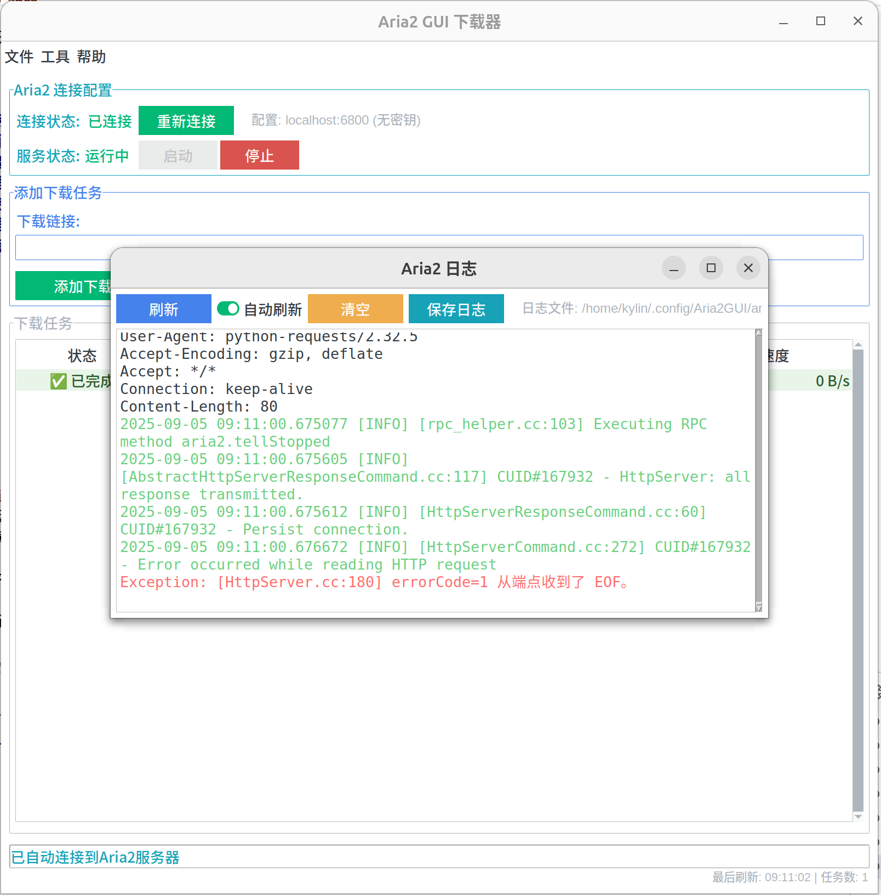

# Aria2 GUI 下载器

一个使用Python开发的Aria2图形界面下载工具，基于Tkinter和ttkbootstrap框架，提供现代化中文界面来管理Aria2下载任务。

## 功能特性

- 🚀 **自动服务管理** - 在GUI中直接启动/停止aria2c服务
- ⚙️ **图形化配置** - 可视化配置aria2c服务器参数
- 🔗 **智能连接** - 自动检测服务状态并连接
- 📥 **下载管理** - 添加、暂停、继续、删除下载任务
- 📊 **实时监控** - 显示下载进度、速度和剩余时间
- 📁 **路径管理** - 跨平台标准路径管理
- 🔄 **自动刷新** - 自动更新任务状态

## 界面预览

### 主界面

- **服务管理**: 自动启动/停止Aria2服务，实时显示连接状态
- **下载管理**: 添加下载链接，管理下载任务
- **任务列表**: 显示下载进度、速度、文件大小等信息
- **右键菜单**: 暂停、继续、删除、打开文件夹等操作

### 配置界面

- **连接配置**: 设置RPC主机、端口、密钥
- **下载配置**: 配置下载目录、最大连接数、最大下载数
- **代理配置**: 设置全局代理服务器
- **日志配置**: 设置日志级别和文件路径

### 日志界面

- **实时日志**: 显示Aria2服务的运行日志
- **自动刷新**: 实时更新日志内容
- **日志级别**: 支持不同级别的日志过滤

## 系统要求

- Python 3.12+
- **Aria2** (必须安装)

## 安装 Aria2

### Windows

1. 下载 Aria2：
   - 访问 [Aria2 官方发布页面](https://github.com/aria2/aria2/releases)
   - 下载最新版本的 Windows 版本
   - 解压到任意目录（如 `C:\aria2`）

2. 添加到系统 PATH：
   - 将 Aria2 目录添加到系统环境变量 PATH 中
   - 或在命令行中测试：`aria2c --version`

### Linux (Ubuntu)

```bash
sudo apt update
sudo apt install aria2
```

### Linux (Debian)

```bash
sudo apt update
sudo apt install aria2
```

### Linux (CentOS/RHEL/Fedora)

```bash
# CentOS/RHEL
sudo yum install aria2
# 或
sudo dnf install aria2

# Fedora
sudo dnf install aria2
```

### macOS

```bash
# 使用 Homebrew
brew install aria2

# 或使用 MacPorts
sudo port install aria2
```

## 安装依赖

### 1. 安装 uv（推荐）

```bash
# Linux/macOS
curl -LsSf https://astral.sh/uv/install.sh | sh

# Windows (PowerShell)
powershell -c "irm https://astral.sh/uv/install.ps1 | iex"
```

### 2. 安装项目依赖

```bash
# 克隆项目
git clone <repository-url>
cd ariax

# 安装依赖
uv sync --index-url https://mirrors.aliyun.com/pypi/simple
```

### 3. 系统依赖（Linux）

```bash
# Ubuntu - 安装 tkinter 支持
sudo apt install python3-tk

# Debian - 安装 tkinter 支持
sudo apt install python3-tk

# CentOS/RHEL/Fedora - 安装 tkinter 支持
sudo yum install tkinter
# 或
sudo dnf install python3-tkinter
```

## 使用方法

### 运行程序

```bash
# 进入项目目录
cd ariax

# 安装依赖
uv sync

# 运行程序
uv run python app/app.py
```

### 基本使用

1. **启动程序** - 运行上述命令启动GUI界面
2. **自动连接** - 程序会自动启动Aria2服务并连接
3. **添加下载** - 在输入框中粘贴下载链接，点击"添加下载"
4. **管理任务** - 在任务列表中暂停、继续、删除下载任务
5. **配置设置** - 点击"配置"按钮修改Aria2参数

### 界面功能

- **服务管理** - 自动启动/停止Aria2服务
- **下载管理** - 添加、暂停、继续、删除下载任务
- **实时监控** - 显示下载进度、速度、剩余时间
- **配置管理** - 图形化配置Aria2参数
- **路径管理** - 跨平台标准路径管理

## 故障排除

### 常见问题

1. **程序无法启动**
   - 确保已安装 Python 3.12+
   - 确保已安装 Aria2
   - 检查依赖是否正确安装：`uv sync`

2. **连接失败**
   - 确保 Aria2 已正确安装并在 PATH 中
   - 检查防火墙设置
   - 查看程序日志信息

3. **下载失败**
   - 检查下载链接是否有效
   - 确认下载路径有写入权限
   - 检查网络连接

## 许可证

本项目采用MIT许可证。
